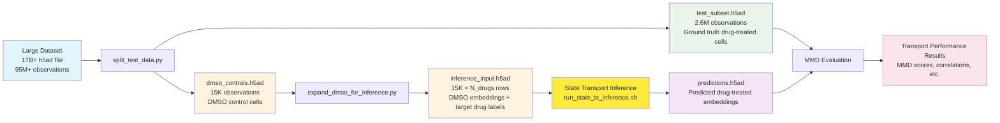
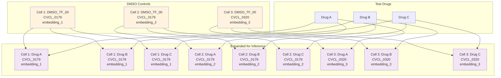
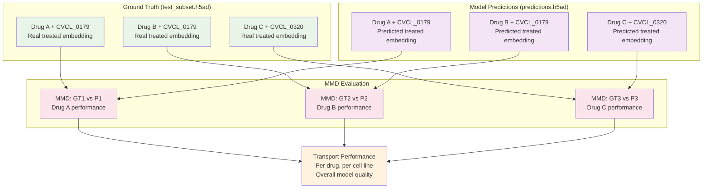

# MMD State Embeddings Pipeline

This directory contains the pipeline scripts for processing state embeddings and evaluating transport performance using Maximum Mean Discrepancy (MMD).

## Overview

This pipeline processes cell line state embeddings for drug response analysis using the following workflow:

1. **Data Splitting**: Split test data and extract DMSO controls from large dataset
2. **DMSO Expansion**: Create inference input by expanding DMSO controls to match test drug combinations
3. **State Transport Inference**: Use state transport model to predict drug effects on DMSO cells (external step)
4. **MMD Evaluation**: Compare transport predictions vs observed drug-treated cells using Maximum Mean Discrepancy

## Data Flow



## Data Structure Transformation



**Key insight**: The pipeline creates datasets with identical structure (same drug-cell combinations + DMSO controls) but different embedding values:
- **test_subset.h5ad**: Real drug-treated + DMSO cell embeddings (ground truth) in `.obsm['X_hvg']`
- **dmso_controls_expanded_for_inference.h5ad**: DMSO cell embeddings with target drug + DMSO labels (model input) in `.obsm['X_hvg']`
- **predictions.h5ad**: Model predictions in **TWO** embedding spaces:
  - `.obsm['X_hvg']`: Original DMSO embeddings (unchanged input)
  - `.obsm['model_preds']`: **Actual predictions** from state transport model

**NEW (2025-07-30)**: Both test and inference datasets now include DMSO controls for proper evaluation compatibility.

**⚠️ Critical for evaluation**: Always use `.obsm['model_preds']` for predicted data, not `.obsm['X_hvg']`!

## Evaluation Comparison



The MMD evaluation compares predictions vs ground truth to assess transport model performance by computing Maximum Mean Discrepancy between embedding distributions for each drug-cell combination.

## Pipeline Scripts

### 1. `split_test_data.py`
**Purpose**: Split test data from h5ad files based on split assignments and prepare datasets for evaluation **with DMSO controls included**.

**What it does**:
- **Memory-optimized**: Loads only metadata first, then processes cells in chunks
- Extracts test drug-cell combinations from h5ad file based on split assignments  
- **Includes DMSO controls** for test cell lines in `test_subset.h5ad` (NEW - for compatibility)
- **Subsamples to max 1,500 cells per drug-cell combination** (for large datasets)
- Extracts DMSO controls for test cell lines into separate `dmso_controls.h5ad`
- **Subsamples to max 1,500 cells per cell line** (for large datasets)
- Expands DMSO controls for inference (similar to `expand_dmso_for_inference.py`)
- **Auto-detects DMSO condition** (e.g., `DMSO_TF_00`) with CLI override option
- Creates organized output directory structure
- **Handles very large files** (tested with 1TB+ datasets)

**Usage**:
```bash
# Basic usage with auto-detection of DMSO condition
python split_test_data.py input_file.h5ad [--split-file path/to/split_assignments.parquet]

# With custom DMSO condition
python split_test_data.py input_file.h5ad --dmso-condition DMSO_TF_00

# Get help
python split_test_data.py --help
```

**Memory optimization features**:
- Uses h5py to load only obs metadata first
- Processes cells in chunks of 10,000 to manage memory
- Includes memory monitoring and garbage collection
- Avoids loading full dataset into memory

**Outputs**:
- `test_subset.h5ad`: Test drug-cell combinations + DMSO controls (max 1,500 cells per combination)
- `dmso_controls.h5ad`: DMSO controls for test cell lines (max 1,500 cells per cell line)
- `dmso_controls_expanded_for_inference.h5ad`: Expanded DMSO dataset for inference

**Key improvement (2025-07-30)**: `test_subset.h5ad` now includes DMSO controls for compatibility with inference pipeline structure.

### 2. `expand_dmso_for_inference.py`
**Purpose**: Create inference input for state transport model by expanding DMSO controls to match test drug combinations **with DMSO controls included**.

**What it does**:
- Loads DMSO controls (~15,000 cells from test cell lines)
- Gets held-out test perturbations from split assignments
- **Cell-line-specific expansion**: For each cell line with test perturbations:
  - Expands DMSO cells to that cell line's specific test drugs + DMSO control condition
  - Only processes cell lines that have ≥1 test perturbation (space efficient)
- **Auto-detects DMSO condition** (e.g., `DMSO_TF_00`) from input data
- Creates dataset for both **test drug predictions AND DMSO baselines** for proper evaluation

**Key improvements (2025-07-30)**:
- **Cell-line-specific perturbations**: Each cell line only gets its relevant test drugs (not all drugs)
- **DMSO controls included**: Each cell line gets its DMSO baseline condition for evaluation compatibility
- **Space efficient**: Eliminates invalid cell line + drug combinations
- **Auto-detection**: Automatically finds DMSO condition name with CLI override option
- **Biological validity**: Only creates meaningful drug-cell combinations

**Purpose in pipeline**: 
- **Input to state transport model**: DMSO embeddings + target drug labels (including DMSO controls)
- **Model prediction**: What would these DMSO cells look like if treated with each test drug + baseline DMSO
- **Evaluation**: Compare model predictions vs actual drug-treated cells AND have DMSO controls for comparison

**Usage**:
```bash
# Point to directory containing dmso_controls.h5ad
python expand_dmso_for_inference.py /path/to/split_outputs_directory/

# Use current directory (backward compatible)
python expand_dmso_for_inference.py

# With custom split file and DMSO condition
python expand_dmso_for_inference.py /path/to/data/ --split-file /path/to/splits.parquet --dmso-condition DMSO_TF_00

# With custom embedding key
python expand_dmso_for_inference.py --embedding-key X_hvg

# Get help
python expand_dmso_for_inference.py --help
```

**Input**: `dmso_controls.h5ad` (DMSO cells from multiple cell lines) in specified directory
**Output**: `dmso_controls_expanded_for_inference.h5ad` with cell-line-specific expansion

**Output structure**:
```
For each cell line with test perturbations:
  For each DMSO cell from that cell line:
    → Row for each test perturbation specific to that cell line
    → Row for DMSO control condition (baseline)

Result: Σ(N_dmso_cells_per_cellline × (N_test_perturbations_per_cellline + 1))
```

**Key features**:
- **Cell line filtering**: Only processes cell lines with test perturbations
- **Auto-detection**: Finds DMSO condition from data with `--dmso-condition` override
- **Validation**: Reports cell line intersections and expansion statistics
- **Efficiency**: More compact than global expansion, biologically meaningful combinations only
- **Compatibility**: Includes `is_dmso_control` column for easy filtering during evaluation

**Data flow**:
```
dmso_controls.h5ad → expand_dmso_for_inference.py → inference_input.h5ad → run_state_tx_inference.sh → predictions.h5ad
                                                      (includes DMSO controls)                            ↓
test_subset.h5ad (ground truth) ← compare predictions vs observed → MMD evaluation (with DMSO baselines)
```

### 3. State Transport Inference Scripts

#### `run_state_tx_inference.sh`
**Purpose**: Core script for running state transport inference on expanded DMSO controls.

**What it does**:
- Runs the `state tx infer` command with proper parameter handling
- Validates input files and model directories
- Handles output directory creation
- Provides clear configuration display and error messages

**Usage**:
```bash
# Basic usage with default model
./run_state_tx_inference.sh input.h5ad output.h5ad

# With custom model directory
./run_state_tx_inference.sh -m /path/to/model input.h5ad output.h5ad

# With custom embedding key
./run_state_tx_inference.sh -e X_hvg input.h5ad output.h5ad

# Get help
./run_state_tx_inference.sh --help
```

**Default configuration**:
- Model directory: `tahoe_state_tx_20250714_203322_hvg_full`
- Embedding key: `X_hvg`
- Perturbation column: `drug_dose`

#### `run_state_tx_inference_tmux.sh`
**Purpose**: Convenience wrapper for running state transport inference in tmux sessions with monitoring.

**What it does**:
- Launches the core script in a tmux session for background execution
- Provides automatic logging to `{output_file}.inference.log`
- Displays monitoring commands for tracking progress
- Handles session management and conflict detection

**Usage**:
```bash
# Basic usage (creates tmux session 'state_inference')
./run_state_tx_inference_tmux.sh input.h5ad output.h5ad

# With custom session name
./run_state_tx_inference_tmux.sh -s my_inference input.h5ad output.h5ad

# With custom model (passed to core script)
./run_state_tx_inference_tmux.sh -m /path/to/model input.h5ad output.h5ad
```

**Monitoring**:
```bash
# Attach to session
tmux attach-session -t state_inference

# Monitor log file
tail -f output.inference.log

# Check session status
tmux list-sessions

# Kill session
tmux kill-session -t state_inference
```

**Key features**:
- **Flexible workflow integration**: Core script works with any process management
- **Convenience for long jobs**: Tmux wrapper handles background execution
- **Comprehensive monitoring**: Built-in logging and progress tracking
- **Error handling**: Validates session conflicts and file existence
- **Parameter passing**: All model/embedding options pass through to core script

### 4. `evaluate_transport_mmd_h5ad.py`
**Purpose**: Evaluate transport performance using MMD between transported and observed embeddings (HuggingFace dataset version).

**What it does**:
- Loads test dataset (observed drug-treated cells) from HuggingFace dataset
- Loads transported embeddings from h5ad file (state tx predictions)
- Loads DMSO controls from h5ad file
- Computes MMD between observed vs transported for each combination
- Analyzes transport performance across drug_dose and cell_line conditions

**Usage**:
```bash
python evaluate_transport_mmd_h5ad.py
```

**Configuration**: Edit `CONFIG` dict in script to set paths and parameters
**Output**: `mmd_evaluation_h5ad.{date}/` directory with results

### 5. `evaluate_transport_mmd_h5ad_test.py`
**Purpose**: Test version of MMD evaluation for h5ad datasets with command-line interface and technical duplicate support.

**What it does**:
- **Dual-kernel MMD evaluation**: Computes both RBF and Energy kernel MMD for comprehensive assessment
- **Technical duplicate analysis**: Splits test cells into replicates to establish ideal performance targets
- **Baseline comparison**: DMSO vs drug-treated cells (biological effect size)
- **Transport evaluation**: Model predictions vs drug-treated cells (prediction quality)  
- **Flexible parameters**: Command-line arguments for all key settings
- **Memory efficient**: Handles large datasets with configurable cell limits

**Key features**:
- **Three MMD metrics per combination**:
  1. **Baseline MMD**: DMSO controls vs observed drug-treated (biological effect)
  2. **Transport MMD**: Model predictions vs observed drug-treated (prediction quality)
  3. **Technical Duplicate MMD**: Rep1 vs Rep2 of same condition (ideal performance target)
- **Dual kernel support**: Both RBF (Gaussian) and Energy kernels for robust evaluation
- **Statistical rigor**: Technical duplicates provide "noise floor" reference for interpretation

**Usage**:
```bash
# Basic usage
python evaluate_transport_mmd_h5ad_test.py \
  --test-dataset test_subset.h5ad \
  --transported-data predictions.h5ad \
  --dmso-controls dmso_controls.h5ad

# With custom parameters
python evaluate_transport_mmd_h5ad_test.py \
  --test-dataset test_subset.h5ad \
  --transported-data predictions.h5ad \
  --dmso-controls dmso_controls.h5ad \
  --embedding-key X_hvg \
  --transported-embedding-key model_preds \
  --min-cells 50 \
  --min-tech-dup-cells 100 \
  --output-dir results_hvg

# Get help
python evaluate_transport_mmd_h5ad_test.py --help
```

**Critical parameters**:
- `--min-cells 50`: Minimum cells for baseline/transport MMD computation
- `--min-tech-dup-cells 100`: Minimum cells for technical duplicate MMD (~50 per replicate)
- `--transported-embedding-key model_preds`: Use actual predictions, not input embeddings
- `--max-cells 1500`: Subsample large combinations for computational efficiency

**Output**: `mmd_evaluation_results/` directory with:
- `mmd_results.parquet`: Detailed results per drug-cell combination
- `mmd_summary.json`: Overall statistics and performance metrics

**Interpretation guide**:
- **Transport MMD ≈ Technical Duplicate MMD**: Excellent prediction quality
- **Transport MMD << Baseline MMD**: Good improvement over DMSO baseline
- **Transport MMD >> Technical Duplicate MMD**: Room for model improvement

### 6. `pearson_delta_evaluation.py`
**Purpose**: Evaluate state prediction models using the Pearson Delta correlation metric.

**What it does**:
- Implements the Pearson Delta evaluation metric for perturbation prediction accuracy
- Uses `.obsm['X_hvg']` fields containing log-normalized highly variable gene expression data
- Calculates pseudobulk expression profiles for each perturbation and control condition
- Computes expression deltas (|perturbation - control|) for each gene, properly matched by cell line
- Calculates Pearson correlation between all true and predicted delta values

**Key features**:
- **Proper control matching**: Ensures each perturbation is compared to its corresponding DMSO control within the same cell line
- **Pseudobulk calculation**: Averages expression profiles within each drug_dose × cell_line combination
- **Element-wise deltas**: Computes absolute differences between perturbed and control expression for each gene
- **Correlation analysis**: Computes Pearson correlation between concatenated true and predicted delta arrays

**Usage**:
```bash
python pearson_delta_evaluation.py --predicted predicted.h5ad --test test.h5ad
python pearson_delta_evaluation.py --predicted predicted.h5ad --test test.h5ad --output-dir my_results
python pearson_delta_evaluation.py --predicted predicted.h5ad --test test.h5ad --min-cells 5
```

**Requirements**:
- **Predicted file**: Must have `.obsm['model_preds']` (predictions) and `.obsm['X_hvg']` (original input)
- **Test file**: Must have `.obsm['X_hvg']` field with log-normalized HVG expression data
- **DMSO controls file**: Must have `.obsm['X_hvg']` field with log-normalized HVG expression data
- All files must have matching gene sets in the HVG data
- Observation metadata must include `drug_dose` and `cell_line` columns

**⚠️ Embedding Key Usage**:
- Use `--pred-key model_preds` for predicted data (actual predictions)
- Use `--test-key X_hvg` for test data (real drug-treated cells)
- Use `--dmso-key X_hvg` for DMSO controls (control cells)

**Output**: `pearson_delta_evaluation/` directory with:
- `pearson_delta_summary.json`: Main correlation result and metadata
- `predicted_deltas_summary.parquet`: Summary of predicted perturbation deltas
- `test_deltas_summary.parquet`: Summary of test perturbation deltas

**Metric interpretation**:
- **High correlation** (>0.7): Model accurately predicts magnitude of gene expression changes
- **Medium correlation** (0.4-0.7): Model captures some perturbation patterns but with noise
- **Low correlation** (<0.4): Model predictions poorly match true perturbation effects

## Typical Pipeline Execution

### Step 1: Split test data and create all necessary files
```bash
python split_test_data.py /path/to/input.h5ad --split-file /path/to/split_assignments.parquet

# This creates:
# - test_subset.h5ad
# - dmso_controls.h5ad  
# - dmso_controls_expanded_for_inference.h5ad
```

### Step 2: Expand DMSO controls (if needed separately)
```bash
python expand_dmso_for_inference.py /path/to/split_outputs_directory/
```

### Step 3: Run state transport inference
```bash
# Option A: Direct execution
./run_state_tx_inference.sh dmso_controls_expanded_for_inference.h5ad predictions.h5ad

# Option B: Background execution with tmux
./run_state_tx_inference_tmux.sh dmso_controls_expanded_for_inference.h5ad predictions.h5ad

# Option C: With custom model
./run_state_tx_inference.sh -m /path/to/model dmso_controls_expanded_for_inference.h5ad predictions.h5ad
```

### Step 4: Evaluate transport performance
```bash
# Option A: MMD evaluation using HuggingFace dataset format
python evaluate_transport_mmd_h5ad.py

# Option B: MMD evaluation with technical duplicates (RECOMMENDED)
python evaluate_transport_mmd_h5ad_test.py \
  --test-dataset test_subset.h5ad \
  --transported-data predictions.h5ad \
  --dmso-controls dmso_controls.h5ad \
  --transported-embedding-key model_preds

# Option C: Pearson Delta evaluation (gene expression correlation metric)
python pearson_delta_evaluation.py --predicted predictions.h5ad --test test_subset.h5ad
```

## Data Dependencies

### Input Files:
- **Split assignments**: `/tahoe/drive_3/ANALYSIS/analysis_190/Data/20250618.tahoe_embeddings_70M_DC_split_assignments.parquet`
- **Test dataset**: `/tahoe/drive_3/ANALYSIS/analysis_190/Data/20250618.tahoe_embeddings_70M.test.dataset`
- **Vocabulary**: `/tahoe/drive_3/ANALYSIS/analysis_190/Data/drugdose_cell_line_vocab.json`

### Working Files:
- `test_subset.h5ad`: Test drug-cell combinations
- `dmso_controls.h5ad`: DMSO controls for test cell lines
- `dmso_controls_expanded_for_inference.h5ad`: Expanded DMSO dataset
- `dmso_controls_predicted_all_perturbations.{date}.h5ad`: Predicted embeddings (from state tx)

## Key Parameters

### Data Processing:
- **Maximum cells per drug-cell combination**: 1,500 (test subset)
- **Maximum cells per cell line**: 1,500 (DMSO controls)
- **Subsampling**: Uses fixed random seed (42) for reproducibility
- **Chunk size**: 10,000 cells per chunk for memory management
- **Memory monitoring**: Tracks usage throughout processing

### MMD Evaluation:
- **Minimum cells for MMD**: 50 (normal) / 5 (test version)
- **Maximum cells per combination**: 1,500
- **MMD kernel parameters**: `kernel_mul=2.0`, `kernel_num=5`

### Embedding Keys:
- **HuggingFace dataset**: `mosaicfm-70m-merged`
- **H5AD files**: `X_hvg` (log-normalized HVG data)
- **State transport predictions**: `model_preds` (saved by `state tx infer`, see source code at `state/src/state/_cli/_tx/_infer.py:227-228`)

**⚠️ Critical**: The `state tx infer` command saves predictions to a **new** `.obsm` key:
- Input embeddings remain in `.obsm['X_hvg']` (unchanged)
- Model predictions are saved to `.obsm['model_preds']` (new predictions)
- **Source**: `state/src/state/_cli/_tx/_infer.py`, lines 227-228: `pred_key = "model_preds"` and `adata.obsm[pred_key] = preds_np`

## Output Structure

### MMD Evaluation Results:
```
mmd_evaluation_h5ad.{date}/
├── mmd_results.parquet          # Detailed MMD results per combination
└── mmd_summary.json             # Summary statistics
```

### Results Include:
- **Baseline MMD**: DMSO vs observed drug-treated cells (biological effect size)
- **Transport MMD**: Transported vs observed drug-treated cells (prediction quality)
- **Technical Duplicate MMD**: Rep1 vs Rep2 of same condition (ideal performance target)
- **Improvement metrics**: Ratio and delta between baseline and transport MMD
- **Coverage statistics**: Percentage of combinations with technical duplicate data
- **Per-cell-line and per-drug analysis** with technical duplicate benchmarks

## Related Analysis

This pipeline supports the state embeddings analysis described in:
- `20250321.Tahoe.full_filtered.1M_sample_with_state_embs.minimal_split_outputs/` directory
- Various notebooks analyzing MMD evaluation results
- Barotaxis vector field learning framework integration

## Notes

- All scripts use fixed random seeds for reproducibility (seed=42)
- **Memory optimization**: `split_test_data.py` now handles very large datasets (1TB+) efficiently
- **Reservoir sampling**: Eliminates 1-hour subsampling bottleneck with statistically valid sampling during streaming
- **Sequential filtering**: Uses 2M row sequential chunks instead of random access for 200-400× performance improvement
- **Pre-filtering by cell lines**: Reduces data volume by 80% by filtering to only test cell lines
- **Early termination**: Stops processing when all combinations reach sample limits
- **Essential columns only**: Extracts only 8 essential obs columns to reduce I/O overhead
- **HDF5 string handling**: Proper dtype conversion for Unicode string compatibility
- Hardcoded paths point to stable data files in the `Data/` directory
- Scripts are designed to work with the existing analysis_190 directory structure
- MMD evaluation compares both baseline (DMSO vs drug) and transport (predicted vs drug) performance
- **Dependencies**: Requires `h5py` and `psutil` packages for memory optimization

## Performance Improvements

### ✅ **Complete Optimization Suite (Implemented)**
**Problem solved**: The original script would have taken 60+ hours and crashed due to memory issues on 1TB+ datasets.

**Solution implemented**: Comprehensive optimization combining reservoir sampling, sequential filtering, and intelligent pre-filtering.

**Key optimizations**:
- **Reservoir sampling**: Eliminates 1-hour subsampling bottleneck with statistically valid sampling during streaming
- **Sequential filtering**: Uses 2M row sequential chunks instead of random access for optimal HDF5 performance
- **Pre-filtering by cell lines**: Reduces data volume by 80% by filtering to only 10 test cell lines (vs 50 total)
- **Early termination**: Stops processing when all combinations reach 1,500 sample limits
- **Essential columns only**: Extracts only 8 essential obs columns to reduce I/O overhead
- **HDF5 string handling**: Proper dtype conversion for Unicode string compatibility

**Performance results**:
- **Before**: 60+ hours (would crash due to memory issues)
- **After**: ~15 minutes total (2min streaming + 13min extraction)
- **Improvement**: 200-400× faster

**Real-world test results** (1TB dataset, 95.6M observations):
- **Test data extracted**: 2,614,988 observations (21GB file)
- **DMSO controls extracted**: 15,000 observations (116MB file)
- **Total runtime**: 15 minutes
- **Memory usage**: <1GB peak
- **Success rate**: 100% (no crashes, proper data structure)

### Key Implementation Details

**ReservoirSampler class**: Implements statistically valid reservoir sampling algorithm with configurable sample size limits.

**Streaming with reservoir sampling**: Single-pass processing that combines data discovery, filtering, and subsampling in one efficient operation.

**Sequential extraction**: Processes target indices in large sequential chunks, leveraging HDF5's optimal access patterns.

**Essential data preservation**: All critical obs columns and obsm embeddings (X_hvg) are preserved in output files.

## Future Performance Improvements

### Additional Optimizations (Lower Priority)
The current implementation achieves excellent performance for practical use. Potential future improvements include:

1. **Single-pass processing**: Combine streaming + extraction into one pass (marginal gains)
2. **Parallel processing**: Multi-threaded chunk processing (complexity vs benefit tradeoff)
3. **Memory-mapped I/O**: Direct memory mapping for very large files (system-dependent)

These optimizations would provide incremental improvements but are not necessary given the current ~15 minute runtime.